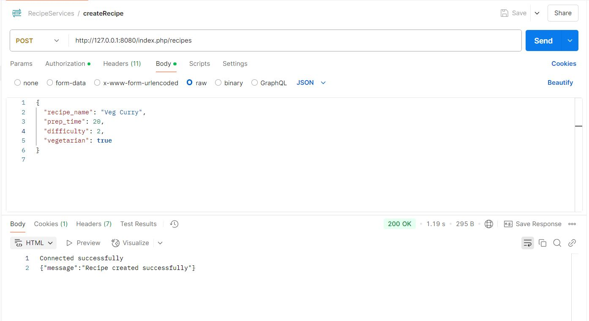
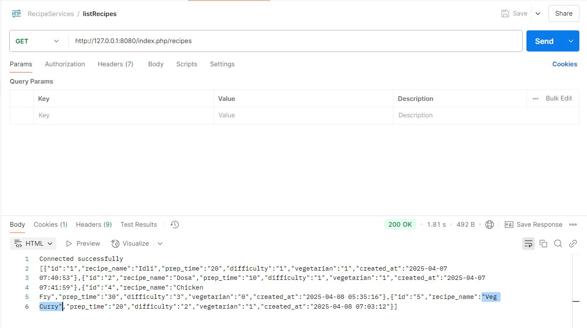
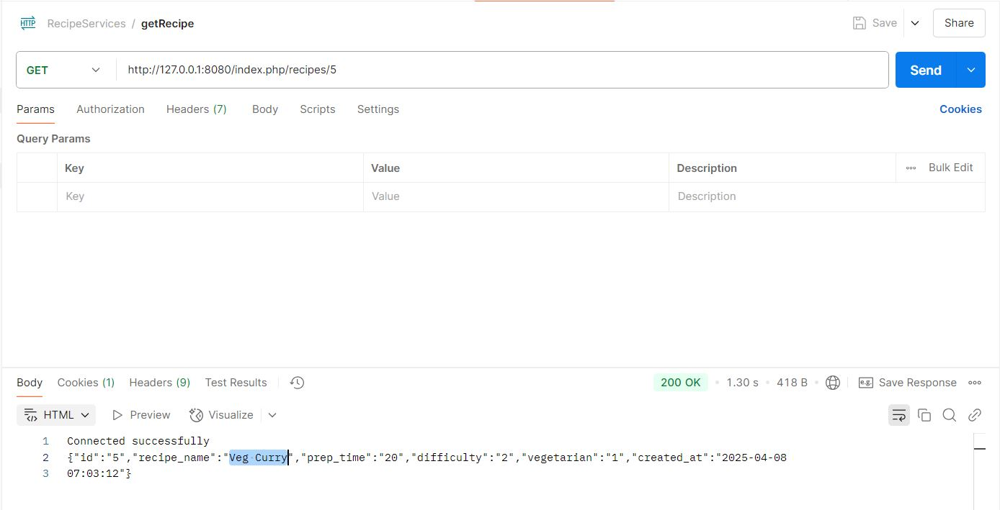
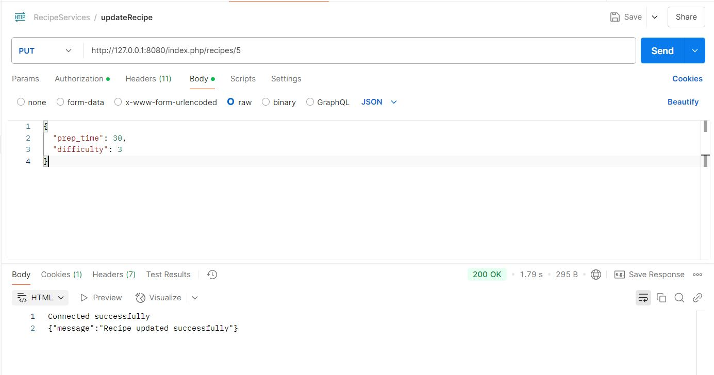
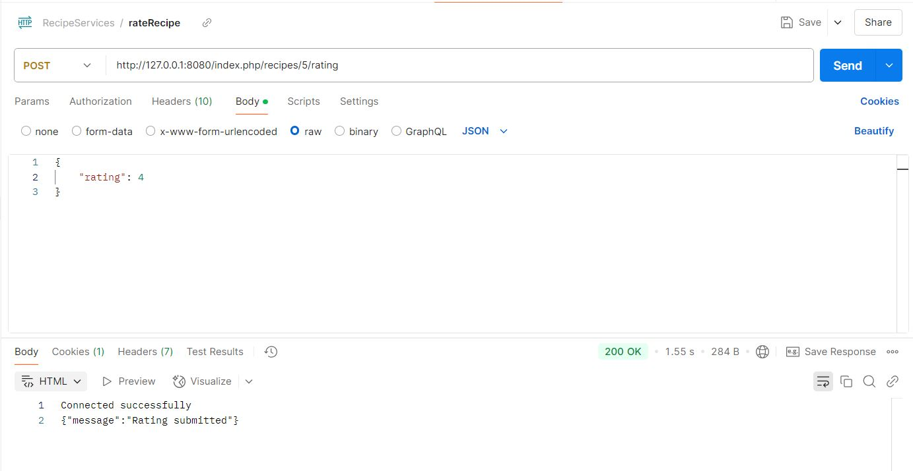
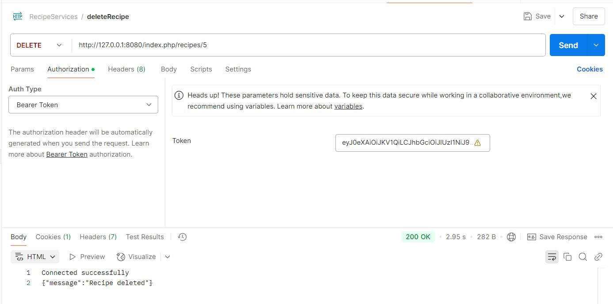
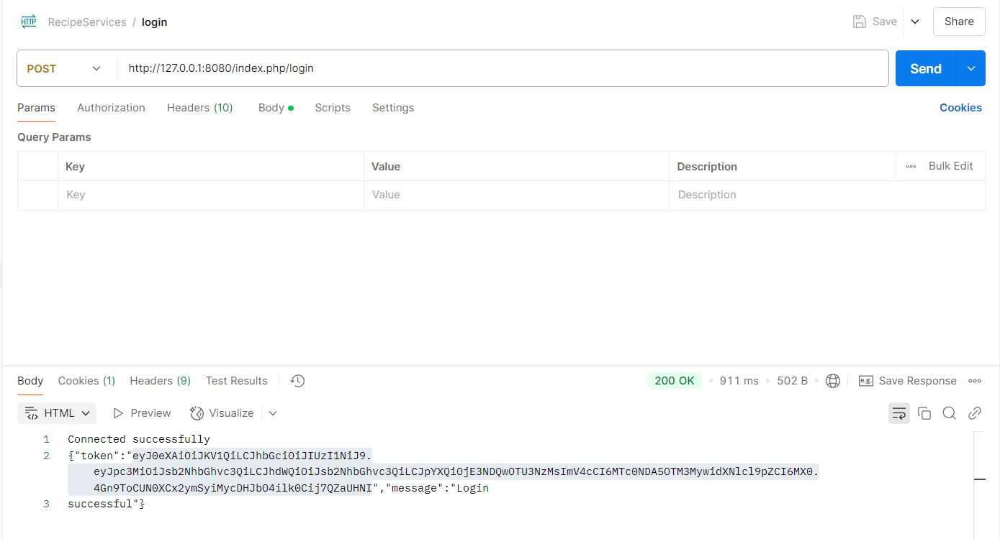
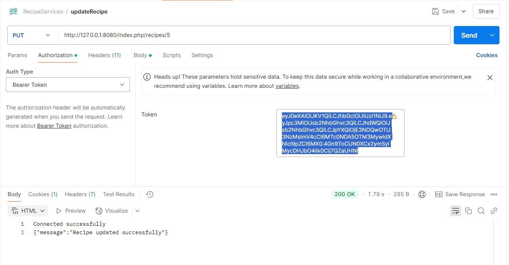
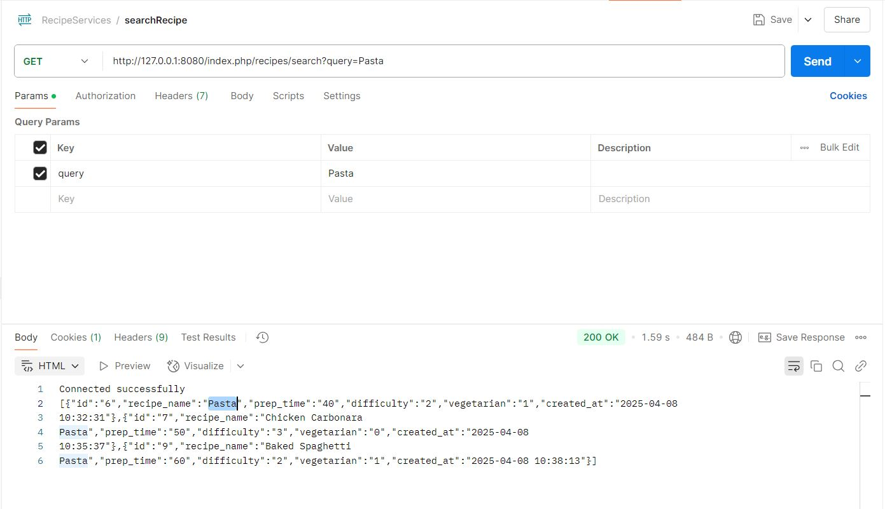

## Index

1. Docker Setup:
   1.1: Changes made in docker-compose.yaml
   1.2: Changes made in Dockerfile
   1.3: Commands to start the docker and verify containers are running

2. Database and Tables Creation:
   2.1: Create and test database connection
   2.2: Tables Creation
   2.3: Tables Structure

3. Recipe API Documentation
   3.1: About JWT Authentication
   3.2: Search API Implementation

4. Recipe API Test Suite - PHPUnit
   4.1: Utility Functions
   4.2: Running Tests

## 1. Docker Setup:

    ## 1.1 Changes made in docker-compose.yaml

    	File : docker-compose.yaml

    	1. Removed the “version: 2”, since the attribute “version” is obsolete.
    	2. Replaced “PostgreSQL” service with “MySQL” service:
              # MySQL Database
              mysql:
                image: mysql:latest
                container_name: mysql_container
                restart: always
                environment:
                  MYSQL_ROOT_USER: root
                  MYSQL_ROOT_PASSWORD: root
                  MYSQL_DATABASE: recipes_db
                  MYSQL_USER: user
                  MYSQL_USER_PASSWORD: password
                ports:
                  - "3306:3306"
                volumes:
                  - mysql_data:/var/lib/mysql

    	3. Modified PHP container to link with MySQL
            php:
                build: .
                restart: unless-stopped
                volumes:
                  - ./:/var/www/html
                ports:
                  - "8080:80"
                  #- "443:443"
                links:
                  - mysql
                  - redis
                environment:
                  DEBUG: "true"
                  DB_CONNECTION: mysql
                  DB_HOST: mysql
                  DB_PORT: 3306
                  DB_DATABASE: recipes_db
                  DB_USERNAME: user
                  DB_PASSWORD: password

    	4. Defined “mysql_data” under volumes: at the end, since MySQL service refers to this volume.
                volumes:
                  mysql_data: # This defines the missing volume

    ## 1.2: Changes made in Dockerfile

        File: Dockerfile

        	1. Commented the line
        		FROM quay.io/hellofresh/php70:7.1, since the image is outdated.
        	    And used the image “php:7.4-apache”.

            	#FROM quay.io/hellofresh/php70:7.1
                   FROM php:7.4-apache

        	2. Commented the line
            	# RUN sed -i -e "s/;clear_env\s*=\s*no/clear_env = no/g" /etc/php/7.4/fpm/pool.d/www.conf
            		Since PHP 7.4 (Apache) does not use FPM by default.

        	3. Installed pdo_mysql extension and running it:
        	    RUN docker-php-ext-install pdo pdo_mysql

            4. Install Composer
                COPY --from=composer:2 /usr/bin/composer /usr/bin/composer

    ## 1.3: Commands to start the docker and verify containers are running

            Rebuild & Restart the Docker Containers:
                docker compose up -d –build

            Verify Containers Are Running:
                docker ps

## Database and Tables Creation:

    ## 2.1: Create and test database connection

        File: database.php
        	The connection to the mysql database (recipes_db) is made by executing:
                $conn = new PDO("mysql:host=$hostname;dbname=$dbname", $username, $password);

            Test Database Connection

            Try running:
                docker exec -it <php_container_name> php /server/http/database.php

            If everything is correctly set up, it should output: "Connected successfully"

     ## 2.2: Tables Creation

        	File: setup_tables.php
        		Execute the file to create tables (recipes and ratings) within the recipes_db, using the command:
                    docker exec -it <php_container_name> php /server/http/setup_tables.php

            NOTE: Verify the tables and it’s structure once again, in the mysql_container.

    ## 2.3: Tables Structure:

        Below are the tables structure:
        1. Table: recipes (to store the data about recipes)
            Column	        Data Type	                                        Description
            id	            INT AUTO_INCREMENT PRIMARY KEY	                    Unique identifier for each recipe, automatically increments.
            recipe_name	    VARCHAR(255) NOT NULL	                            Name of the recipe (max 255 characters). Cannot be NULL.
            prep_time	    INT NOT NULL	                                    Preparation time in minutes. Cannot be NULL.
            difficulty	    TINYINT NOT NULL CHECK (difficulty BETWEEN 1 AND 3)	Difficulty level (1 to 3).
            vegetarian	    BOOLEAN NOT NULL	                                Whether the recipe is vegetarian (true/false). Cannot be NULL.
            created_at	    TIMESTAMP DEFAULT CURRENT_TIMESTAMP                 Stores the date and time of creation. Defaults to the current timestamp.

            CHECK constraint: ensures values is in the given range. Example: The value of “difficulty” column should be in the range of 1 to 3. It can be 1 or 2 or 3.

        2. Table: ratings (to give ratings to the recipes)
            Column	        Data Type	                                   Description
            id	            INT AUTO_INCREMENT PRIMARY KEY                 Unique ID for each rating. Automatically increments.
            recipe_id	    INT NOT NULL	                               Foreign key linking to recipes.id (each rating belongs to a recipe)
            rating	    TINYINT NOT NULL CHECK (rating BETWEEN 1 AND 5)    Rating value between 1 (worst) and 5 (best). The constraint ensures the value is valid.
            created_at	    TIMESTAMP DEFAULT CURRENT_TIMESTAMP	           Timestamp of when the rating was added. Defaults to the current time.

        3. FOREIGN KEY (recipe_id) REFERENCES recipes(id) ON DELETE CASCADE
            This ensures that "recipe_id" in the ratings table must exist in the recipes table.
            ON DELETE CASCADE → If a recipe is deleted from the recipes table, all its ratings will be deleted automatically.

        4. The ENGINE=InnoDB specifies that the InnoDB storage engine is used. This supports transactions and foreign keys.

## 3. Recipe API Documentation

        Base URL: http://127.0.0.1:8080/index.php

        1. Create a New Recipe

            Endpoint: POST /recipes
            Description: Creates a new recipe.
            Authentication: JWT required

            Request Body:
            {
              "recipe_name": "Pasta",
              "prep_time": 20,
              "difficulty": 2,
              "vegetarian": true
            }

            Responses:
            •	201 Created – Recipe successfully created.
            •	400 Bad Request – Missing required fields.
            •	422 Unprocessable Entity – Invalid data.
            •	401 Unauthorized – JWT token missing/invalid.

                

        2. Get All Recipes

            Endpoint: GET /recipes
            Description: Fetches all recipes.
            Authentication:  Public

            Responses:
            •	200 OK – List of recipes.
            •	500 Internal Server Error – Database/server issue.

                

        3. Get Recipe by ID

            Endpoint: GET /recipes/{id}
            Description: Fetches a single recipe by ID.
            Authentication:  Public

            Responses:
            •	200 OK – Recipe found.
            •	404 Not Found – Recipe does not exist.

                

        4. Update a Recipe

            Endpoint: PUT /recipes/{id}
            Description: Updates a specific recipe.
            Authentication:  JWT required

            Request Body:
            {
              "recipe_name": "Updated Name",
              "prep_time": 25,
              "difficulty": 3,
              "vegetarian": false
            }

            Responses:
            •	200 OK – Successfully updated.
            •	400/422 – Missing or invalid data.
            •	401 Unauthorized – JWT token missing/invalid.
            •	404 Not Found – Recipe not found.

             

         5. Add Rating to a Recipe
            Endpoint: POST /recipes/{id}/rating
            Description: Adds a rating to a specific recipe.
            Authentication:  Public

            Request Body:
            {
              "rating": 4
            }

            Responses:
            •	201 Created – Rating added.
            •	400/422 – Missing or invalid rating.
            •	404 Not Found – Recipe not found.

                

        6. Delete a Recipe
            Endpoint: DELETE /recipes/{id}
            Description: Deletes a recipe by ID and its associated ratings.
            Authentication:  JWT required

            Responses:
            •	200 OK – Recipe and its ratings deleted.
            •	404 Not Found – Recipe not found.
            •	401 Unauthorized – JWT token missing/invalid.

                

    # 3.1: About JWT Authentication

            JWT (JSON Web Token) is used to secure API endpoints like creating, updating, and deleting recipes.
            The firebase/php-jwt library is used to handle JWT generation and validation.
            We stored the JWT secret key securely in a .env file.

            AuthService.php
                This service provides two methods:
                    generateToken($userId) – to generate a JWT.
                    validateToken($token) – to decode and validate incoming tokens.

                     

            Login Route (Dummy Authentication)
                We added a /login endpoint that accepts a POST request with dummy credentials.
                     

            Protecting Routes
                To secure the sensitive API endpoints, we:
                    Check for the "Authorization" header.
                    Extract and validate the token using AuthService::validateToken().

                     

            Protected Endpoints
                Endpoint	    Method
                /recipes	    POST
                /recipes/{id}	PUT/PATCH
                /recipes/{id}	DELETE

    ## 3.2: Search API Implementation

        The method searchRecipe() in RecipeService.php implements the search functionality. It does the following things:
            1. Accepts a search term.
            2. Uses a prepared statement with the LIKE operator to find recipes whose names contain the search term.
            3. Returns an array of matching recipes. If there’s an error, it returns an error message with a 500 HTTP status.
            4. Finally, the routing in index.php is updated.

            

## 4. Recipe API Test Suite - PHPUnit

      1. testListRecipes()

          Verifies the GET /recipes endpoint returns:
            HTTP 200
            JSON array with recipe_name key

      2. testGetRecipe()

          Creates a recipe
          Then tests GET /recipes/{id} for that recipe
          Asserts:
            HTTP 200
            JSON with recipe_name key

      3. testUpdateRecipe()

          Creates a recipe
          Sends a PUT /recipes/{id} request with updated fields
          Asserts success message "Recipe updated successfully"

      4. testDeleteRecipe()

          Creates a recipe
          Deletes it via DELETE /recipes/{id}
          Tries to fetch it again and expects "Recipe not found"

    ## 4.1: Utility Functions

      1. getJwtToken():
          Authenticates using /login with dummy credentials
          Returns JWT for authenticated routes

      2. getStatusCode(array $http_response_header):
          Extracts status code (e.g., 200, 404) from HTTP response header

      3. createTestRecipe(array $data = [])
          Creates a new recipe with optional overrides
          Returns the newly created recipe ID
          Used by testUpdateRecipe() and testDeleteRecipe()

    ## 4.2: Running Tests

        To run all tests:

            php ./vendor/bin/phpunit tests/RecipeApiTests.php

        To run a specific method:

            php ./vendor/bin/phpunit --filter testUpdateRecipe tests/RecipeApiTests.php
